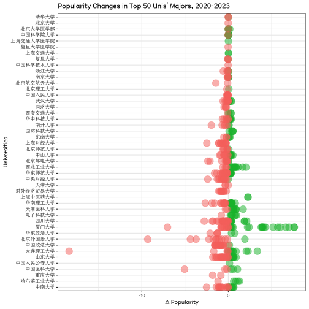

## 高考志愿填报趋势大揭秘——以山东省为例
## College Entrance Exam Major Selection: A Case Study of Shandong Province

The article analyzes changes in college application preferences among high school graduates in Shandong Province from 2020 to 2023. Shandong Province was chosen because of its large number of test-takers and the standardized data format available from the local education examination authority.

The analysis involved standardizing the admission scores of different majors within the same university on a scale of 1-100. The article then categorized the admission scores into high, medium-high, medium-low, and low segments to compare the popularity of various majors over the years.

**Conclusions**

	1.	Popular majors for lower-ranking students remained relatively stable, while those for higher-ranking students changed significantly.
	2.	From 2020 to 2023, the popularity of lesser-known language majors decreased, while computer science, software engineering, and electronic information majors increased in popularity.
	3.	Top universities showed stable changes in major popularity, while mid-tier universities experienced significant shifts.
	4.	Many majors at Xiamen University saw a significant rise in popularity, while majors at Central South University and Beijing Foreign Studies University showed a notable decline.

