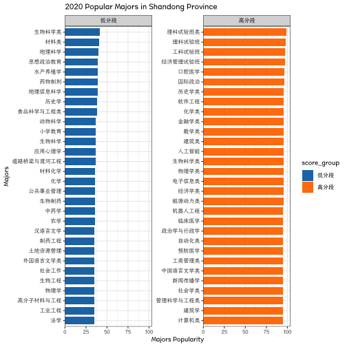
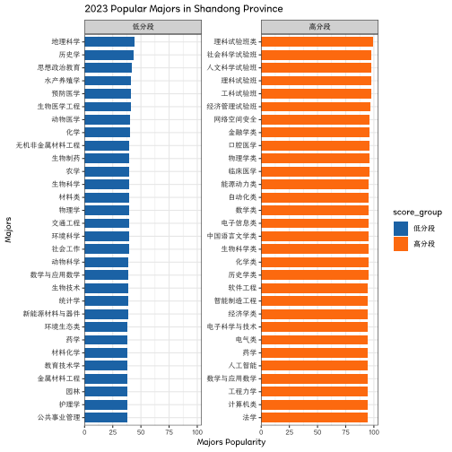
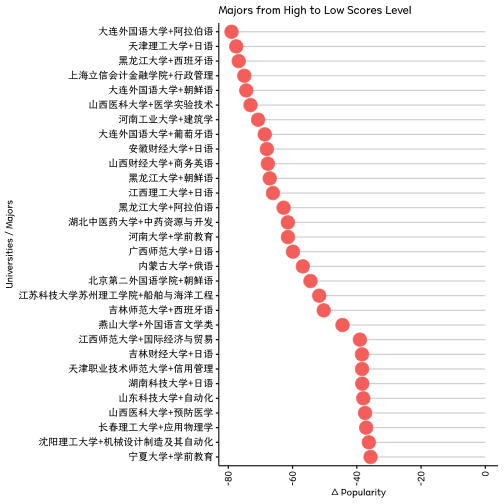
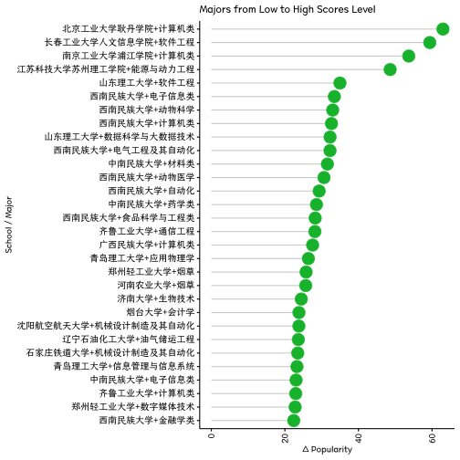
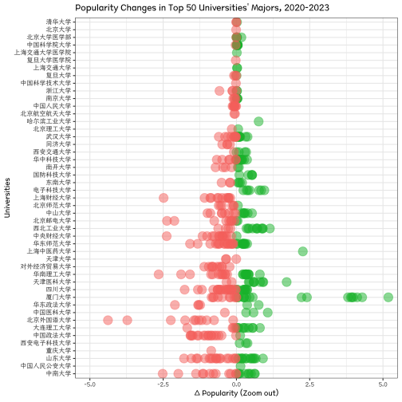
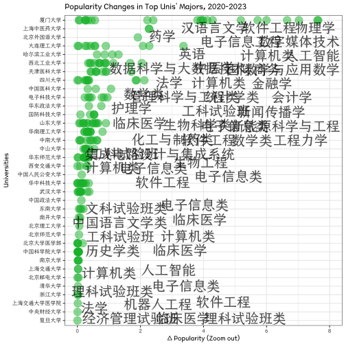

```r
knitr::opts_chunk$set(echo = TRUE)
knitr::opts_knit$set(root.dir = "/Users/sousekilyu/Documents/GitHub/GaoKaoVer2")
```


## Data preparation


```r
source("~/Documents/GitHub/GaoKaoVer2/main/etl.R")
```

```
## Joining with `by = join_by(school)`
```

```r
source("/Users/sousekilyu/Documents/GitHub/GaoKaoVer2/main/function.r")
```


## 热门专业变化趋势分析
### 哪些专业变多？哪些专业消失？


```r
.tmp <- dt_rank_cmb_rough %>%
    group_by(year, major) %>%
    summarise(n = n_distinct(`院校`), .groups = "drop_last") %>%
    mutate(n_over_total = n/sum(n)) %>% 
    arrange(desc(n_over_total))
```


## 热门专业与考生成绩分布关系
### 高分段考生 vs 低分段考生


```r
score_by_major_group_time <- dt_rank_cmb_rough %>%
    group_by(year) %>%
    arrange(score_by_major_scale) %>% 
    mutate(
        score_group = cut(
            score_by_major_scale,
            breaks = c(-Inf, 50, 70, 90, Inf),
            labels = c("低分段", "中低分段", "中高分段", "高分段")
        )
    )  %>% 
    arrange(score_by_school_scale) %>% 
    mutate(
        score_group_school = cut(
            score_by_school_scale,
            breaks = c(-Inf, 50, 70, 90, Inf),
            labels = c("低分段", "中低分段", "中高分段", "高分段")
    )
    )
head(score_by_major_group_time)
```

```
## # A tibble: 6 × 14
## # Groups:   year [2]
##   院校                 major       frequency rank_by_major rank_by_school  year school city  province score_by_major_scale
##   <chr>                <chr>           <dbl>         <dbl>          <dbl> <dbl> <chr>  <chr> <chr>                   <dbl>
## 1 C928泉州职业技术大学 油气储运工…        10        260585         256142  2020 泉州…  泉州… 福建省                   1.19
## 2 C928泉州职业技术大学 汽车服务工…         5        259516         256142  2020 泉州…  泉州… 福建省                   1.60
## 3 C928泉州职业技术大学 计算机类            5        257697         256142  2020 泉州…  泉州… 福建省                   2.29
## 4 C928泉州职业技术大学 机械设计制…         5        256142         256142  2020 泉州…  泉州… 福建省                   2.88
## 5 D857山东华宇工学院   房地产开发…        90        250390         243940  2021 山东…  德州… 山东省                   3.15
## 6 D857山东华宇工学院   道路桥梁与…        45        249705         243940  2021 山东…  德州… 山东省                   3.41
## # ℹ 4 more variables: score_by_school_scale <dbl>, major_rough <chr>, score_group <fct>, score_group_school <fct>
```

```r
generate_plot <- function(time) {
    plot <- score_by_major_group_time %>%
        filter(
            score_group %in% c("低分段", "高分段"),
            year == time
        ) %>%
        group_by(score_group, major) %>%
        summarise(avg_scores = mean(score_by_major_scale, na.rm = TRUE), .groups = "keep") %>%
        group_by(score_group) %>%
        ggcharts::bar_chart(major, avg_scores, fill = score_group, facet = score_group, top_n = 30) +
        theme_bw() +
        theme(text = element_text(family = "Canger", size = 10)) +
        labs(title = paste0(time, " Popular Majors in Shandong Province"), x = "Majors", y = "Majors Popularity")
}
# Generate plots
# 2020
p1 <- generate_plot(2020)
print(p1)
```



```r
ggsaveTheme(p1,
    mytheme = my_theme,
    filename = "plot/Figure 1.major_by_score_2020.png",
    width = 12,
    height = 16,
    dpi = 300
)
# 2023
p2 <- generate_plot(2023)
print(p2)
```



```r
ggsaveTheme(p2,
    mytheme = my_theme,
    filename = "plot/Figure 2.major_by_score_2023.png",
    width = 12,
    height = 16,
    dpi = 300
)
```


## 从低分段 跃迁至高分段的 学校和专业


```r
# (中)高分段=>(中)低分段
high2low <- score_by_major_group_time %>%
    filter((year == 2020 & score_group %in% c("高分段", "中高分段")) |
        (year == 2023 & score_group %in% c("低分段", "中低分段"))) %>%
    dplyr::select(院校, major, major_rough, year, score_by_major_scale) %>%
    group_by(院校, major, major_rough) %>%
    arrange(year) %>%
    summarise(
        countn = n(),
        score_by_major_early = first(score_by_major_scale),
        score_by_major_later = last(score_by_major_scale),
        score_by_major_change = score_by_major_later - score_by_major_early,
        .groups = "drop"
    ) %>%
    filter(countn == 2) %>%
    arrange(score_by_major_change) %>%
    mutate(school_major = paste0(substr(院校, 5, nchar(院校)), "+", major)) %>%
    filter(!is.na(school_major))

# 高分段=>(中)低分段
low2high <- score_by_major_group_time %>%
    filter((year == 2020 & score_group %in% c("低分段", "中低分段")) |
        (year == 2023 & score_group %in% c("高分段", "中高分段"))) %>%
    dplyr::select(院校, major, major_rough, year, score_by_major_scale) %>%
    group_by(院校, major, major_rough) %>%
    arrange(year) %>%
    summarise(
        countn = n(),
        score_by_major_early = first(score_by_major_scale),
        score_by_major_later = last(score_by_major_scale),
        score_by_major_change = score_by_major_later - score_by_major_early,
        .groups = "drop"
    ) %>%
    filter(countn == 2) %>%
    arrange(desc(score_by_major_change)) %>%
    mutate(school_major = paste0(substr(院校, 5, nchar(院校)), "+", major)) %>%
    filter(!is.na(school_major))
# plot: https://www.r-bloggers.com/2017/06/bar-plots-and-modern-alternatives/
phl01 <- high2low[1:30, ] %>%
    ggdotchart(
        x = "school_major", y = "score_by_major_change",
        color = "#F8756D",
        sorting = "descending",
        add = "segments",
        dot.size = 6,
        ggtheme = theme_pubr()
    ) +
    rotate() +
    # theme_bw() +
    theme(text = element_text(family = "Canger", size = 10)) +
    labs(title = "Majors from High to Low Scores Level", x = "Universities / Majors", y = "Δ Popularity")
print(phl01)
```



```r
ggsaveTheme(phl01,
    mytheme = my_theme,
    filename = "plot/Figure 3.high2low.png",
    width = 12,
    height = 16,
    dpi = 300
)
phl02 <- low2high[1:30, ] %>%
    ggdotchart(
        x = "school_major", y = "score_by_major_change",
        color = "#00BA38",
        sorting = "ascending",
        add = "segments",
        dot.size = 6,
        ggtheme = theme_pubr()
    ) +
    rotate() +
    # theme_bw() +
    theme(text = element_text(family = "Canger", size = 10)) +
    labs(title = "Majors from Low to High Scores Level", x = "School / Major", y = "Δ Popularity")
print(phl02)
```



```r
ggsaveTheme(phl02,
    mytheme = my_theme,
    filename = "plot/Figure 4.low2high.png",
    width = 12,
    height = 16,
    dpi = 300
)
```


## 2020-2023专业热度变化分布


```r
# Plot the distribution of the change in scores by major
# Calculate the average scores by major
avg_scores <- score_by_major_rough_change %>%
    filter(major_rough %in% majorData_rough$major) %>%
    group_by(major_rough) %>%
    summarise(avg_score = mean(score_by_major_change), .groups = "keep")
head(avg_scores)
```

```
## # A tibble: 6 × 2
## # Groups:   major_rough [6]
##   major_rough        avg_score
##   <chr>                  <dbl>
## 1 临床医学               4.22 
## 2 信息管理与图书情报     4.48 
## 3 公共管理类            -0.646
## 4 农业类                 5.17 
## 5 化学类                 2.30 
## 6 历史学类               4.88
```

```r
# Add the average scores to the graph
p <- score_by_major_rough_change %>%
    filter(major_rough %in% majorData_rough$major) %>%
    mutate(color = ifelse(score_by_major_change >= 0, "上涨", "下降")) %>%
    ggplot(aes(x = score_by_major_change, fill = color)) +
    geom_histogram(bins = 100) +
    facet_wrap(~ reorder(major_rough, score_by_major_change, FUN = mean), dir = "h") +
    coord_cartesian(xlim = c(-30, 30), ylim = c(0, 150)) +
    scale_fill_manual(
        values = c("上涨" = "#00BA38", "下降" = "#F8756D"),
        labels = c("上涨" = "Increase", "下降" = "Decrease"),
        name = "Δ Popularity"
    ) +
    theme_bw() +
    theme(
        text = element_text(family = "Canger", size = 10),
        legend.position = c(.8, .07),
    ) +
    labs(title = "Histogram of Popularity Changes in Major Categories", x = "2020-2023 Δ Popularity", y = "Freq.")
# save png
print(p)
```


```r
ggsaveTheme(p,
    mytheme = my_theme_legend,
    filename = "plot/Figure 5.score_by_major_rough_change.png",
    width = 16,
    height = 12,
    dpi = 300
)
```

## 热门高校变化
### 热门高校一线&新一线城市聚集度变化


```r
# # 高分学校在大城市占比 vs 高分专业在大城市占比。学校分数线体现底线思维，专业分数线体现择优思维。结果：重点城市的高分学校聚集度上涨，高分专业聚集度没有上涨
# #' 说明：
# #' 1. 从学校报考维度，学生倾向于去重点城市的学校就读，区域因素很重要，用重点城市学校「托底」；
# #' 2. 从专业选择角度，学生更加实际，在能选择的范围内专业优先，而非地域优先。
# score_by_major_group_time %>%
#     filter(score_group_school %in% c("中高分段", "高分段")) %>%
#     dplyr::select(school, year, city, province, score_group_school) %>%
#     unique() %>%
#     group_by(year) %>%
#     summarise(
#         fraction = round(sum(ifelse(city %in% core_city, 1, 0)) / n(), 3)
#     )
# #
# score_by_major_group_time %>%
#     filter(score_group %in% c("中高分段", "高分段")) %>%
#     dplyr::select(school, major, year, city, province, score_group) %>%
#     unique() %>%
#     group_by(year) %>%
#     summarise(
#         fraction = round(sum(ifelse(city %in% core_city, 1, 0)) / n(), 3)
#     )
# ## 论据：主要大城市的「热门」专业占比并没有显著增加
# score_by_major_group_time %>%
#     filter(city %in% core_city) %>%
#     dplyr::select(school, major, major_rough, year, city, province, score_group) %>%
#     group_by(year) %>%
#     summarise(
#         fraction = round(sum(ifelse(major_rough %in% c("软件工程", "电气类", "汉语言", "计算机类", "通信类"), 1, 0)) / n(), 3)
#     )
```


### 重点高校专业热度变化 / 高分段学校的低分段专业，同理


```r
# !!! 考虑到学校最低分收到专业极大影响，院校位次分数根据中位数排名，而非最低位次
dt_school_top <- dt_rank_cmb %>%
    mutate(school = substr(院校, 5, nchar(院校))) %>%
    filter(year == 2023) %>%
    mutate(rank = dense_rank(desc(score_by_school_scale))) %>%
    # filter(rank <= 30) %>%
    ungroup()
dt_school_top_change <- score_by_major_rough_change %>%
    filter(院校 %in% dt_school_top$院校) %>%
    left_join(unique(select(dt_school_top, 院校, score_by_school_scale, school, rank)),
        by = "院校"
    )
head(dt_school_top_change)
```

```
## # A tibble: 6 × 12
##   院校            major province city   countn score_by_major_early score_by_major_later score_by_major_change major_rough
##   <chr>           <chr> <chr>    <chr>   <int>                <dbl>                <dbl>                 <dbl> <chr>      
## 1 D904北京工业大… 计算… 北京市   北京市      2                 12.5                 75.4                  63.0 计算机类   
## 2 D601长春工业大… 软件… 吉林省   长春市      2                 13.2                 72.6                  59.4 软件工程   
## 3 D905南京工业大… 计算… 江苏省   南京市      2                 25.1                 78.8                  53.7 计算机类   
## 4 D991江苏科技大… 能源… 江苏省   苏州市      2                 22.4                 71.0                  48.6 能源与动力…
## 5 D897天津理工大… 数据… 天津市   天津市      2                 19.5                 67.3                  47.8 数据科学与…
## 6 D897天津理工大… 软件… 天津市   天津市      2                 20.8                 66.7                  45.9 软件工程   
## # ℹ 3 more variables: score_by_school_scale <dbl>, school <chr>, rank <int>
```

```r
p_school_change <- dt_school_top_change %>%
    filter(rank <= 50) %>%
    ggplot(aes(
        x = score_by_major_change,
        y = reorder(school, score_by_school_scale),
        color = ifelse(score_by_major_change > 0, "#00BA38", "#F8756D")
    )) +
    geom_point(size = 5, alpha = .5) +
    scale_color_identity() +
    # scale_x_log10() +
    theme_bw() +
    theme(text = element_text(family = "Canger", size = 10)) +
    labs(title = "Popularity Changes in Top 50 Universities' Majors, 2020-2023", x = "Δ Popularity", y = "Universities")
# save png
print(p_school_change)
```


```r
ggsaveTheme(p_school_change,
    mytheme = my_theme,
    filename = "plot/Figure 6.top_uni_change_by_major.png",
    width = 12,
    height = 16,
    dpi = 300
)

dt_school_top <- dt_rank_cmb %>%
    mutate(school = substr(院校, 5, nchar(院校))) %>%
    filter(year == 2023) %>%
    mutate(rank = dense_rank(desc(score_by_school_scale))) %>%
    # filter(rank <= 30) %>%
    ungroup()
dt_school_top_change <- score_by_major_rough_change %>%
    filter(院校 %in% dt_school_top$院校) %>%
    left_join(unique(select(dt_school_top, 院校, score_by_school_scale, school, rank)),
        by = "院校"
    )
head(dt_school_top_change)
```

```
## # A tibble: 6 × 12
##   院校            major province city   countn score_by_major_early score_by_major_later score_by_major_change major_rough
##   <chr>           <chr> <chr>    <chr>   <int>                <dbl>                <dbl>                 <dbl> <chr>      
## 1 D904北京工业大… 计算… 北京市   北京市      2                 12.5                 75.4                  63.0 计算机类   
## 2 D601长春工业大… 软件… 吉林省   长春市      2                 13.2                 72.6                  59.4 软件工程   
## 3 D905南京工业大… 计算… 江苏省   南京市      2                 25.1                 78.8                  53.7 计算机类   
## 4 D991江苏科技大… 能源… 江苏省   苏州市      2                 22.4                 71.0                  48.6 能源与动力…
## 5 D897天津理工大… 数据… 天津市   天津市      2                 19.5                 67.3                  47.8 数据科学与…
## 6 D897天津理工大… 软件… 天津市   天津市      2                 20.8                 66.7                  45.9 软件工程   
## # ℹ 3 more variables: score_by_school_scale <dbl>, school <chr>, rank <int>
```

```r
# zoom out
p_school_change_zoom <- dt_school_top_change %>%
    filter(rank <= 50) %>%
    ggplot(aes(
        x = score_by_major_change,
        y = reorder(school, score_by_school_scale),
        color = ifelse(score_by_major_change > 0, "#00BA38", "#F8756D")
    )) +
    geom_point(size = 5, alpha = .5) +
    scale_color_identity() +
    coord_cartesian(xlim = c(-5, 5)) +
    # scale_x_log10() +
    theme_bw() +
    theme(text = element_text(family = "Canger", size = 10)) +
    labs(title = "Popularity Changes in Top 50 Universities' Majors, 2020-2023", x = "Δ Popularity (Zoom out)", y = "Universities")
# save png
print(p_school_change_zoom)
```



```r
ggsaveTheme(p_school_change_zoom,
    mytheme = my_theme,
    filename = "plot/Figure 7.top_uni_change_by_major_zoom.png",
    width = 12,
    height = 16,
    dpi = 300
)
```


### 名校「冷门」专业对高分考生的吸引力


```r
# 名校冷门专业占比 变化不大
project211 <- c(
    "北京大学", "中国人民大学", "清华大学", "北京交通大学", "北京工业大学", "北京航空航天大学",
    "北京理工大学", "北京科技大学", "北京化工大学", "北京邮电大学", "中国农业大学", "北京林业大学",
    "北京中医药大学", "北京师范大学", "北京外国语大学", "中国传媒大学", "中央财经大学", "对外经济贸易大学",
    "北京体育大学", "中央音乐学院", "中央民族大学", "中国政法大学", "华北电力大学", "南开大学",
    "天津大学", "天津医科大学", "河北工业大学", "太原理工大学", "内蒙古大学", "辽宁大学",
    "大连理工大学", "东北大学", "大连海事大学", "吉林大学", "延边大学", "东北师范大学",
    "哈尔滨工业大学", "哈尔滨工程大学", "东北农业大学", "东北林业大学", "复旦大学", "同济大学",
    "上海交通大学", "华东理工大学", "东华大学", "华东师范大学", "上海外国语大学", "上海财经大学",
    "上海大学", "第二军医大学", "南京大学", "苏州大学", "东南大学", "南京航空航天大学",
    "南京理工大学", "中国矿业大学", "河海大学", "江南大学", "南京农业大学", "中国药科大学",
    "南京师范大学", "浙江大学", "安徽大学", "中国科学技术大学", "合肥工业大学", "厦门大学",
    "福州大学", "南昌大学", "山东大学", "中国海洋大学", "中国石油大学", "郑州大学",
    "武汉大学", "华中科技大学", "中国地质大学", "武汉理工大学", "华中农业大学", "华中师范大学",
    "中南财经政法大学", "湖南大学", "中南大学", "湖南师范大学", "国防科技大学", "中山大学",
    "暨南大学", "华南理工大学", "华南师范大学", "广西大学", "海南大学", "四川大学",
    "重庆大学", "西南交通大学", "电子科技大学", "四川农业大学", "西南大学", "西南财经大学",
    "贵州大学", "云南大学", "西藏大学", "西北大学", "西安交通大学", "西北工业大学",
    "西安电子科技大学", "长安大学", "西北农林科技大学", "陕西师范大学", "第四军医大学", "兰州大学",
    "青海大学", "宁夏大学", "新疆大学", "石河子大学"
)
dt01 <- score_by_major_group_time %>%
    filter(school %in% project211) %>%
    dplyr::select(school, major, major_rough, year, city, province, score_group) %>%
    group_by(year) %>%
    summarise(
        fraction01 = round(sum(ifelse(major_rough %in% c("外国语言文学", "环境科学类", "公共管理类", "哲学", "新闻传播学", "建筑学类", "土木工程类", "经济学类", "金融类", "地质学"), 1, 0)) / n(), 3)
    )
# 对高分考生的吸引力已经减弱
dt02 <- score_by_major_group_time %>%
    filter(
        major_rough %in% c("外国语言文学", "环境科学类", "公共管理类", "哲学", "新闻传播学", "建筑学类", "土木工程类", "经济学类", "金融类", "地质学"),
        school %in% project211
    ) %>%
    dplyr::select(school, major, major_rough, year, city, province, score_group) %>%
    group_by(year) %>%
    summarise(
        fraction02 = round(sum(ifelse(score_group %in% c("高分段"), 1, 0)) / n(), 3)
    )
dt_merge <- left_join(dt01, dt02) %>%
    mutate(fraction02_plot = fraction01 * fraction02)
```

```
## Joining with `by = join_by(year)`
```

```r
real_value <- c(dt_merge$fraction01, dt_merge$fraction02)
# plot dt_merge as barplot
dp1 <- dt_merge %>%
    gather(key = "variable", value = "value", -year) %>%
    filter(variable %in% c("fraction01", "fraction02_plot")) %>%
    data.frame(value2 = as.character(formattable::percent(real_value))) %>%
    mutate(
        value = formattable::percent(value),
        value2 = ifelse(variable == "fraction02_plot", paste0(value2, " in majs."), value2)
    ) %>%
    ggplot(aes(x = year, y = value, fill = variable)) +
    geom_bar(stat = "identity", position = position_dodge()) +
    geom_text(aes(label = value2), position = position_dodge(width = 0.9), vjust = -0.25) +
    scale_fill_manual("", values = c("#016FBC", "#E8BA00"), labels = c("fraction01" = "% of Unpop. Majs.", "fraction02_plot" = "% of High-Scoring Majs. in Unpop. Majs.")) +
    theme_bw() +
    theme(
        text = element_text(family = "Canger", size = 10),
        legend.position = "bottom"
    ) +
    labs(title = "% of Unpopular Majors in 985 & 211 Univs.", x = "Year", y = "Percentage %", fill = "Variable")

print(dp1)
```



```r
dp1 <- dp1 +
    geom_text(aes(label = value2), position = position_dodge(width = 0.9), vjust = -0.25, size = 25)
ggsaveTheme(dp1,
    mytheme = my_theme_legend_define,
    filename = "plot/Figure 8.percentage of unpopular majors in univs.png",
    width = 16,
    height = 12,
    dpi = 300
)
```

