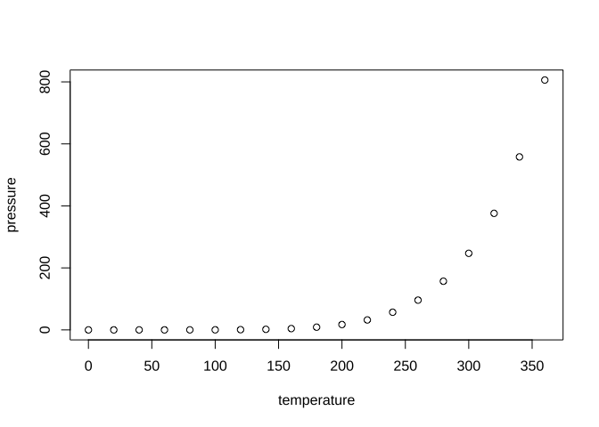

Untitled
================

## Data preparation

``` r
source("~/Documents/GitHub/GaoKaoVer2/main/ETL.R")
```

    ## 
    ## Attaching package: 'dplyr'

    ## The following objects are masked from 'package:data.table':
    ## 
    ##     between, first, last

    ## The following objects are masked from 'package:stats':
    ## 
    ##     filter, lag

    ## The following objects are masked from 'package:base':
    ## 
    ##     intersect, setdiff, setequal, union

    ## Loading required package: RColorBrewer

    ## Loading required package: sysfonts

    ## Loading required package: showtextdb

    ## 
    ## Attaching package: 'ggstance'

    ## The following objects are masked from 'package:ggplot2':
    ## 
    ##     geom_errorbarh, GeomErrorbarh

    ## ggbreak v0.1.2
    ## 
    ## If you use ggbreak in published research, please cite the following
    ## paper:
    ## 
    ## S Xu, M Chen, T Feng, L Zhan, L Zhou, G Yu. Use ggbreak to effectively
    ## utilize plotting space to deal with large datasets and outliers.
    ## Frontiers in Genetics. 2021, 12:774846. doi: 10.3389/fgene.2021.774846

    ## 
    ## Attaching package: 'plotly'

    ## The following object is masked from 'package:ggplot2':
    ## 
    ##     last_plot

    ## The following object is masked from 'package:stats':
    ## 
    ##     filter

    ## The following object is masked from 'package:graphics':
    ## 
    ##     layout

``` r
# Calculate the scaled score for each major based on its rank
# The higher the score_by_major_scale, the more popular the major is
dt_rank_cmb <- dt_rank_cmb %>%
    group_by(year) %>%
    mutate(
        score_by_major_scale = 100 - (rank_by_major - min(rank_by_major)) / (max(rank_by_major) - min(rank_by_major)) * 100,
        score_by_school_scale = 100 - (rank_by_school - min(rank_by_school)) / (max(rank_by_school) - min(rank_by_school)) * 100
    ) %>%
    ungroup()

# Calculate the change in scores by major over time
score_by_major_change <- dt_rank_cmb %>%
    group_by(院校, major) %>%
    filter(year %in% c(2020, 2023)) %>%
    arrange(year) %>%
    summarise(
        # Calculate the change in scores by major over time
        countn = n(),
        score_by_major_early = first(score_by_major_scale),
        # Get the first score for each major
        score_by_major_later = last(score_by_major_scale),
        # Get the last score for each major
        score_by_major_change = score_by_major_later - score_by_major_early, # Calculate the change in scores
        .groups = "drop_last"
    ) %>%
    filter(countn > 1) %>%
    ungroup() %>%
    arrange(desc(score_by_major_change)) # Arrange the data by the change in scores in descending order
# slice(1:100)
# The variable 'score_by_major_change' represents the change in popularity of a major.
# A negative value indicates a decrease in popularity, making it less popular.
# A positive value indicates an increase in popularity, making it more popular.

# Roughly categorize the majors
majorData_rough$major <- as.character(majorData_rough$major)
update_major_rough <- function(df, majorData_rough) {
    df$major_rough <- NA
    for (i in 1:nrow(majorData_rough)) {
        df$major_rough[grepl(majorData_rough$noun[i], df$major)] <- majorData_rough$major[i]
    }
    df %<>%
        mutate(major_rough = ifelse(!is.na(major_rough), major_rough, major))

    return(df)
}
score_by_major_rough_change <- update_major_rough(score_by_major_change, majorData_rough)
```

## Including Plots

You can also embed plots, for example:

<!-- -->

Note that the `echo = FALSE` parameter was added to the code chunk to
prevent printing of the R code that generated the plot.
